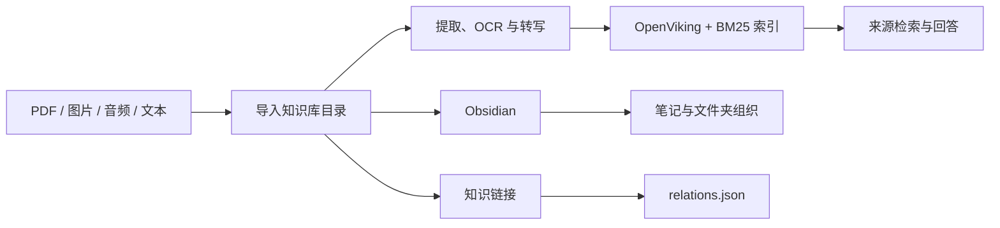

<div align="center">

# Personal KB

## 打造专属于你的知识库！

### Local-first knowledge workspace for your documents, notes, and learning materials.

将资料沉淀为可检索、可管理、可关联的个人知识库。

[](#快速开始)
[](#技术构成)
[](#技术构成)
[](#开发与验证)
[](#项目状态)

**[核心能力](#核心能力)** · **[快速开始](#快速开始)** · **[使用方式](#使用方式)** · **[技术构成](#技术构成)** · **[项目状态](#项目状态)**

</div>

---

## 概览

Personal KB 是一个面向个人学习与长期资料管理的 Windows 桌面知识库。选择一个本地文件夹作为知识库后，你可以直接把 PDF、图片、音频、文本或整个文件夹放进去；应用会提取内容、建立索引，并在提问时回到原始资料中寻找依据。

它不试图替代你的文件系统或 Obsidian，而是让两者成为同一套工作空间：文件仍由你掌控，资料库可直接被 Obsidian 打开，索引、转写与知识关系则由应用维护。

> **当前为 Windows Preview。** 安装包不包含 Python、OpenViking、语音模型、API Key 或任何用户资料。

## 核心能力

| 资料进入 | 资料理解 | 资料连接 |
| --- | --- | --- |
| 导入 PDF、图片、音频、文本、Markdown 和整个文件夹 | PDF 提取、视觉 OCR、图表说明、WhisperX 本地转写 | 文件夹层级管理、Obsidian 协作与集中式知识链接 |
| 支持直接扫描知识库目录中的新增资料 | OpenViking 语义检索 + BM25 词法检索 | 相关知识、同一课堂、前后关系 |
| 一键更新、批量处理、回收站 | DeepSeek 基于检索原文组织回答，并保留来源入口 | 为后续知识网络提供稳定的关系数据 |

## 工作流



## 使用方式

### 1. 选择你的知识库目录

在“设置”中选择一个文件夹，例如 `D:\资料库`。这个文件夹就是你的知识库本体，原始文件始终由你自己管理。

```text
资料库/
  收件箱/                   新导入资料的默认位置
  数学/线性代数/             你自己组织的文件夹与资料
  notes/                    按需创建的 Obsidian Markdown 笔记
  .personal-kb/             应用维护的数据，请勿手动修改
    artifacts/              提取、OCR 与转写后的文本
    records/                每份资料的处理记录
    lexical-index.json      本地 BM25 索引
    relations.json          整个知识库的知识链接
    recycle/                回收站
```

### 2. 放入资料，或直接拖入文件夹

在“资料库”中拖入文件或文件夹，也可以直接向知识库目录添加资料。之后打开“资源管理”，点击“一键更新”扫描变化并处理新增内容。

### 3. 搜索、管理与关联

- 在“搜索”中使用完整问题，例如：`线性变换的几何意义是什么？`
- 在“资源管理”中按文件夹浏览、排序、筛选、批量处理或移入回收站。
- 选中多份资料后，可建立“相关知识”“同一课堂”或“前后关系”。
- 需要整理笔记时，按需创建关联笔记，并在 Obsidian 中继续编辑。

更多面向使用者的说明见 [新手使用指南](docs/Personal-KB-新手使用指南.md)。

## 与 Obsidian 共用一个资料库

在 Obsidian 中选择“打开文件夹作为仓库”，然后选择知识库根目录，例如 `D:\资料库`，不要选择 `.personal-kb`。

Personal KB 不会自动为每份资料创建笔记。只有在资源管理中选择“创建关联笔记”时，才会在 `notes/` 下生成 Markdown。知识链接也不会生成大量笔记，而是集中写入 `.personal-kb/relations.json`，避免打乱原有 Obsidian 结构。

## 快速开始

### 环境要求

| 项目 | 用途 | 是否必需 |
| --- | --- | --- |
| Windows 10/11 | 当前桌面端平台 | 是 |
| Python 3.11+ | 本地处理与检索脚本 | 是 |
| OpenViking 服务 | 语义索引与检索 | 是 |
| DeepSeek API Key | 将检索结果组织为回答 | 按需 |
| DashScope API Key | 图片 OCR、图表说明等视觉处理 | 按需 |
| NVIDIA GPU + CUDA | 加速 WhisperX 音频转写 | 建议 |
| Obsidian | 编辑笔记与查看图谱 | 可选 |

### 从源码运行

```powershell
git clone <你的仓库地址>
cd personal-kb

python -m venv .venv
.venv\Scripts\activate
python -m pip install -r requirements.txt
python -m pip install -r requirements-live.txt

cd desktop
npm ci
npm run tauri dev
```

需要本地音频转写、GPU 或额外 OCR 能力时，再安装媒体依赖：

```powershell
python -m pip install -r requirements-media.txt
```

### 构建 Windows 安装包

```powershell
cd desktop
npm run tauri -- build
```

安装包生成在：

```text
desktop/src-tauri/target/release/bundle/nsis/Personal KB_0.1.0_x64-setup.exe
```

## 隐私、模型与费用

- 原始资料、处理产物、索引和知识链接默认保存在本地知识库目录。
- WhisperX 默认在本地运行；使用 CPU 也可转写，但速度会较慢。
- DashScope 仅在图片 OCR、图表说明等视觉任务时接收必要内容。
- DeepSeek 仅在回答时接收你的问题与检索到的上下文。
- API 调用可能产生费用，请在服务商控制台检查模型和计费设置。

## 技术构成

| 层级 | 方案 |
| --- | --- |
| 桌面端 | Tauri 2、React、TypeScript、Vite |
| 文档与媒体处理 | PyMuPDF、Pillow、WhisperX（基于 Faster-Whisper） |
| 检索 | OpenViking、BM25、`rank-bm25` |
| 模型服务 | DeepSeek、DashScope |
| 知识协作 | 本地文件系统、Obsidian、集中式 `relations.json` |

## 项目状态

- [x] **资料导入与处理**：导入文件或文件夹，处理 PDF、图片、音频与文本资料并建立索引。
- [x] **检索与资料管理**：按文件夹管理资料，通过来源检索提问，并支持一键更新与回收站。
- [x] **Obsidian 与知识链接**：将资料库直接作为 Obsidian 仓库使用；按需创建关联笔记，并记录资料间的知识关系。
- [ ] **知识网络构建**：更方便地编辑知识关系链接，并以可视化知识图谱呈现资料之间的关联。

## 已知限制

- 当前仅支持 Windows。
- `.ppt` / `.pptx` 建议先导出为 PDF 再导入。
- 当前安装包不是完全独立版，首次使用仍需准备 Python 与 OpenViking。

## 开发与验证

```powershell
python -m pytest -q
python -m compileall -q scripts tests test_runs

cd desktop
npm run build
cd src-tauri
cargo check
```

当前本地验证结果：**332 项 Python 测试通过**，前端生产构建与 Tauri Rust 检查通过。

仓库不会包含知识库内容、API Key、模型缓存、构建产物或 `node_modules`。提交前请运行 `git status --ignored`，确认没有提交真实资料、转写文本、截图中的个人信息或 `.personal-kb`。

## 上游与授权

Personal KB 基于 [TobyCh04/cornell-kb](https://github.com/TobyCh04/cornell-kb) 的资料处理、来源检索和 Obsidian 协作基础改造而来，并经原作者同意 Fork 与修改。

上游项目当前未声明统一许可证。请保留上游链接与授权记录；在获得原作者关于许可证的明确确认前，本项目不自行添加 MIT 或其他通用开源许可证。

## 贡献

欢迎提交问题与改进建议。提交前请阅读 [贡献指南](CONTRIBUTING.md)，并确保日志、截图和复现资料不包含个人知识库内容或密钥。
